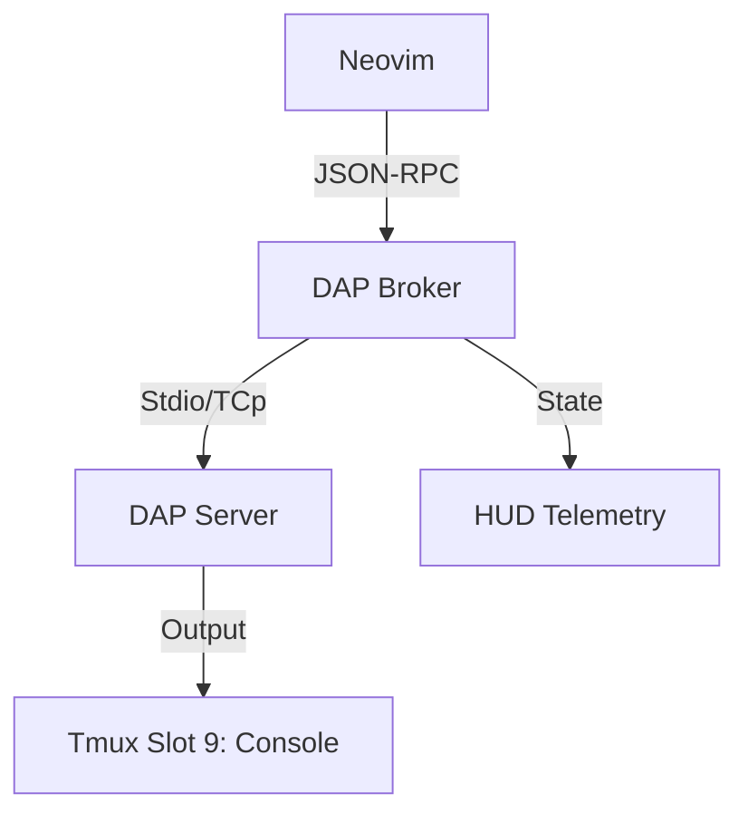

# Design: Headless DAP

## 1. Contextual Architecture
The DAP system consists of three layers:
- **Editor (Frontend)**: Neovim (using `nvim-dap`) providing the UI for breakpoints and variable inspection.
- **DAP Proxy (Broker)**: A background script `core/services/dap_proxy.sh` that mediates between Nvim and the DAP Server.
- **DAP Console (Persistent TUI)**: A Tmux pane in Slot 9 that mirrors the DAP stdout/stderr.

## 2. The DAP Lifecycle
1.  User enters `:debug start`.
2.  `router.sh` triggers `core/exec/dap_handler.sh`.
3.  A background Tmux session/window is created for the Headless DAP Server.
4.  Nvim attaches to the broker's pipe.
5.  State is preserved in `/tmp/nexus_dap_state.json`.

## 3. Communication Pattern

## 4. Tmux Reserved Slots
- **Slot 9**: Reserved for "DAP Console".
- **Hotkey**: `Alt-9` to instantly focus the debug output.
