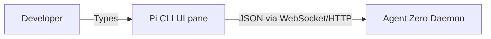

# Design: Pi Frontend Integration

## 1. System Architecture

### 1.1 High-Level Overview
The `pi` CLI will be configured via a custom profile or arguments to route conversational I/O to the background Agent Zero API daemon.

### 1.2 Core Components
1. **`bin/nxs-chat` Wrapper**: A shell script that initializes `pi` with the correct endpoint URLs (e.g., pointing to `localhost:5000` or wherever the Agent Zero WebSocket binds).
2. **API Bridging**: Ensuring Agent Zero exposes a compatible generic Chat API or WebSocket frame format that `pi` can consume.
3. **`ai-pair.json` Composition Update**: The geometric layout config must map the AI pane to execute `nxs-chat`.

## 2. Component Design

### 2.1 The Wrapper Script
**Location**: `bin/nxs-chat`
**Responsibilities**:
- Verify Agent Zero daemon status.
- Execute `pi` with CLI flags defining the custom API backend, model aliases, and overriding system prompts if necessary.

### 2.2 Composition Layout
**Location**: `compositions/ai-pair.json`
**Responsibilities**:
- Spawn Neovim on the left, standard terminal on bottom right, and `nxs-chat` tightly packed on top right.
