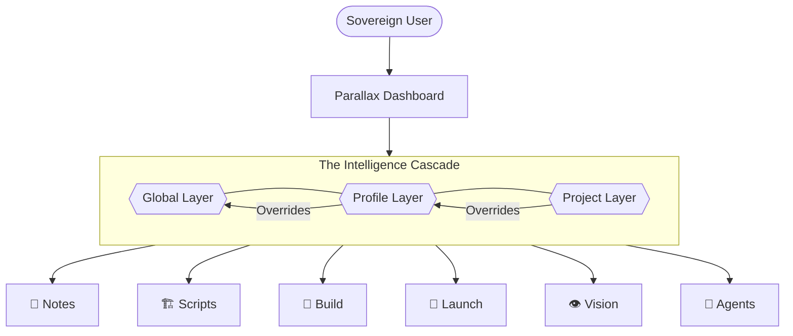
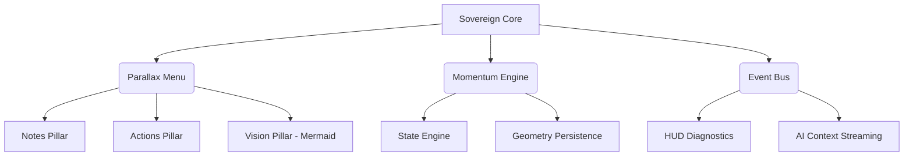

# Nexus V1: The Sovereign Meta-IDE

## The Philosophy
Nexus Shell is not a tool; it is a **Multiplexer of Intentions**. It is the bridge between the raw power of the terminal and the structured logic of an IDE. It respects existing open-source wisdom (Nvim, Pi, Yazi) by providing them with a high-fidelity, momentum-aware spatial layer.

## The Architecture: Cascading Sovereignty
The Intelligence Pillars follow a deterministic hierarchy of discovery and authority:

## V1 Core Invariants
1. **Modeless Sovereignty**: No "Normal Mode." No locked states. `Alt` (Option) is the universal modifier.
2. **Indestructible Momentum**: The IDE remembers your geometry and your tools across every restart.
3. **The Intelligence Trinity**: Notes, Actions, and Places served directly from project metadata.
4. **Quantum Layouts**: Shifting shapes in milliseconds (`Alt-v`, `Alt-s`, `Alt-f`).

## The "Vision Pillar" (Mermaid)
We are bringing architectural sovereignty to the menu.
- **Source**: `.nexus/vision/*.mmd`
- **Behavior**: 
    - `Enter`: Launch as a rendered SVG/PDF in a browser or viewer.
    - `Alt-E`: Edit the Mermaid code in Nvim.

### Structural Mermaid Architecture

## V1 Roadmap (Final Polish)
- [ ] **Flat Keymap**: Remove Normal Mode complexity.
- [ ] **Quantum Focus**: `Alt-f` for instant full-screen.
- [ ] **Vision Pillar**: Implement dynamic discovery of `.nexus/vision/`.
- [ ] **Sovereign Export**: `:save <name>` to burn momentum into blueprints.
