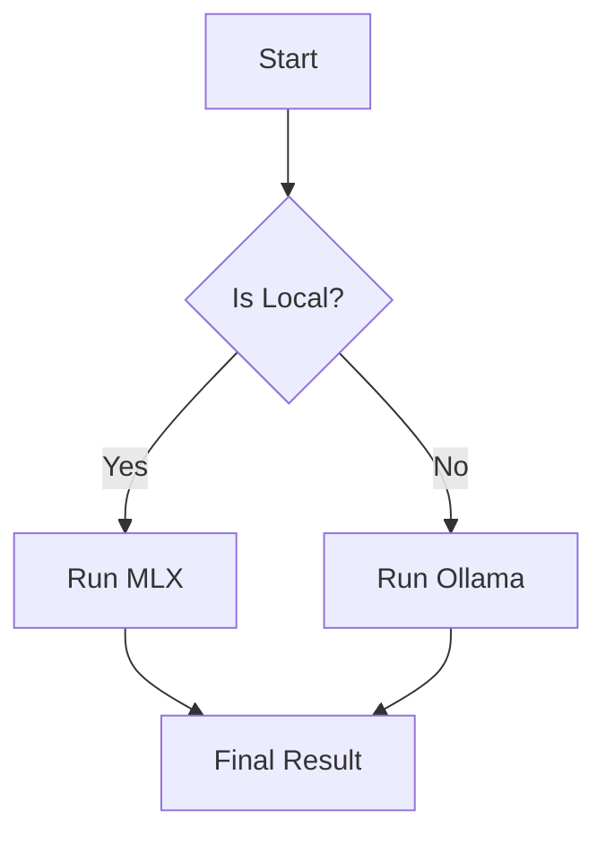

# Nexus Intelligence Test

## Provenance Graph

```mermaid
graph TD
    A[Start] --> B{Is Local?}
    B -- Yes --> C[Run MLX]
    B -- No --> D[Run Ollama]
    C --> E[Final Result]
    D --> E
```

## Hardware Spec
- **Device**: MacBook Pro M4 Pro
- **Memory**: 48GB Unified
- **Cores**: 14 CPU / 20 GPU
