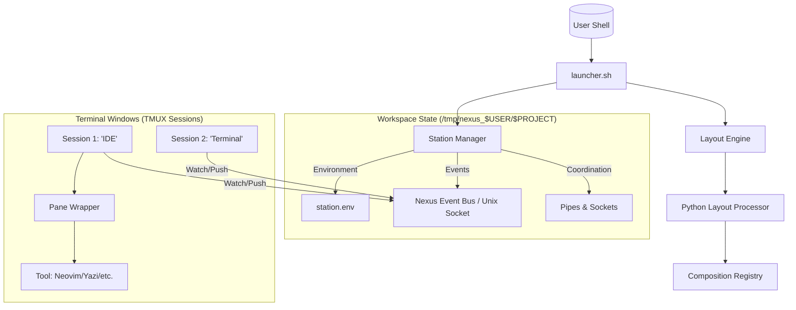

# Design: Nexus-Shell Composable Architecture

## Overview
The modular architecture of Nexus-Shell is centered around a "Station" concept that spans multiple tmux sessions. A Station provides the shared state (environment, pipes, project context), while individual "Compositions" define the visual layout and active modules in a specific terminal window.

## Architecture



## Components and Interfaces

### Station Manager (`core/api/station_manager.sh`)
**Role**: Single source of truth for project-wide state and coordination.

**Responsibilities**:
- Create and maintain `/tmp/nexus_$(whoami)/$PROJECT_NAME/` state directory.
- Manage atomic state updates for environment variables and persistent tool pointers.
- Coordinate shared resources like Neovim RPC pipes.

### Composition Registry (`compositions/*.json`)
**Role**: Data-driven layout definitions.

**Implemented Schema**:
```json
{
  "name": "vscodelike",
  "layout": {
    "type": "hsplit",
    "panes": [
      {
        "id": "files",
        "size": 30,
        "command": "$NEXUS_FILES '$PROJECT_ROOT'"
      },
      {
        "type": "vsplit",
        "panes": [
          { "id": "editor", "command": "$EDITOR_CMD" },
          { "id": "terminal", "command": "/bin/zsh -i" }
        ]
      }
    ]
  }
}
```

### Layout Engine & Processor (`core/layout/`)
**Role**: Transforms static composition data into a live tmux window.

**Interface**:
1. `layout_engine.sh`: Standardizes environment variables and calls the processor.
2. `processor.py`: Recursively parses the JSON layout and executes `tmux split-window` and `send-keys` commands.

**Environment Invariant**: All tool-specific variables (`$EDITOR_CMD`, `$PARALLAX_CMD`, etc.) must be explicitly exported by the engine before the processor starts to ensure they propagate to new panes.

### Pane Lifecycle Management (`core/boot/pane_wrapper.sh`)
**Role**: Ensures pane survival and provides a fallback TUI for tool selection.

**Design**:
- Every tool is launched *inside* the wrapper.
- If a tool crashes or exits, the wrapper catches the exit and displays the "Nexus Pane Hub" (FZF menu).
- Prevents the "blank pane" or "auto-closing window" syndrome.

### Embedded Tool Mode (Nexus Interop)
**Role**: Protocol for external tools (like Parallax) to coordinate with the parent station.

**Invariant**:
- Tools detect `PX_NEXUS_MODE=1`.
- Skip session creation; run directly in the provided pane.
- Use the shared Station API for context instead of private state.

## Project Repository Structure (Nexus 2.0 Standard)
```text
nexus-shell/
├── bin/                # Public entry points -> core/boot/launcher.sh
├── core/               # The Kernel (Static, privileged logic)
│   ├── boot/           # Launcher, pane_wrapper, shell_hooks
│   ├── api/            # Station Manager (nxs-state)
│   ├── layout/         # Layout Engine & Python Processor
│   └── bridge/         # Cross-agent coordination (transaction_ui)
├── modules/            # The Apps (Idempotent, standardized toolkits)
├── compositions/       # The Desktops (JSON layout templates)
├── lib/                # Shared logic libraries
└── specs/              # Kiro documents (Requirements, Design, Tasks)
```

## Correctness Properties

**Property 1: Pane Indestructibility**
For any tool launch, the pane wrapper shall ensure that a usable shell or hub menu remains active regardless of the tool's exit status.

**Property 2: Path Zero-Entropy**
The system shall calculate all absolute paths at boot time relative to the launcher's physical location, ensuring the station works regardless of where the repo is cloned.

**Property 3: Environment Hermeticity**
Modules shall only depend on variables provided by the Station Kernel or explicitly defined in their own `init.zsh`.
