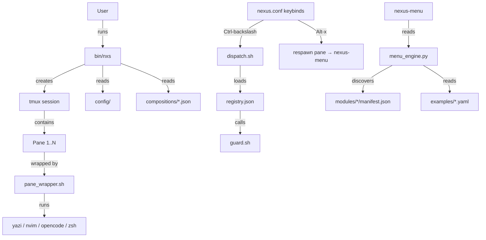

# Design: Nexus-Shell Phase 1 — UI & Session Layer

## 1. System Architecture

### 1.1 High-Level Overview
Nexus-Shell is a tmux-orchestrated shell IDE. The user runs `nxs` which creates a tmux session, builds a layout from a JSON composition, and wraps each pane with a lifecycle manager. A central menu system (FZF-driven) provides tool discovery and navigation.



### 1.2 Core Components
1. **`bin/nxs`** — Session supervisor. Creates tmux session, propagates env, invokes layout engine.
2. **`core/layout/processor.py`** — Reads JSON composition, splits panes, assigns commands.
3. **`core/boot/pane_wrapper.sh`** — Wraps each pane command. Handles exit → shell fallback.
4. **`modules/menu/bin/nexus-menu`** — FZF loop for tool discovery and in-pane execution.
5. **`core/boot/dispatch.sh`** — Command prompt handler (`:q`, `:help`, etc.).
6. **`config/tmux/nexus.conf`** — All keybinds and tmux styling.

## 2. Component Design

### 2.1 Session Supervisor — `bin/nxs` (Req-1)
**Location**: `bin/nxs`
**Responsibilities**:
- Recursion guard (check `$NEXUS_STATION_ACTIVE` and `$TMUX`)
- Resolve `NEXUS_HOME` from script location
- Load configuration hierarchy (global → project `.nexus.yaml`)
- Create tmux session with composition layout
- Propagate environment variables **globally** (`set-environment -g`)

**Critical fix**: Line 150-157 currently uses `tmux set-environment -t` (per-session). This must change to `tmux set-environment -g` for `NEXUS_HOME`, `NEXUS_CORE`, and `NEXUS_BOOT` so that `run-shell` commands in keybinds can resolve these variables.

### 2.2 Pane Wrapper — `pane_wrapper.sh` (Req-2)
**Location**: `core/boot/pane_wrapper.sh`
**Responsibilities**:
- Run the assigned command once
- On exit (any code), drop to `/bin/zsh -i`
- On SIGTERM/SIGHUP, exit cleanly (no restart, no shell)

**Design**:
```bash
#!/bin/bash
trap 'pkill -P $$ 2>/dev/null; exit 0' SIGTERM SIGHUP

COMMAND="$@"
if [[ -n "$COMMAND" ]]; then
    eval "$COMMAND"
fi

# Tool exited — drop to a shell so the pane stays alive
exec /bin/zsh -i
```

No loop. No restart. No logging to stdout. The `exec` replaces the wrapper process with zsh, so there's no dangling parent.

### 2.3 Escape-to-Menu Keybind (Req-2, Req-5)
**Mechanism**: A tmux keybind (`Alt-x`) that kills the current pane's content and replaces it with `nexus-menu`.

**Implementation**: Use `tmux respawn-pane -k` which kills the current process in a pane and starts a new one without destroying the pane itself.

```
bind-key -n M-x respawn-pane -k "$WRAPPER $PARALLAX_CMD"
```

This ensures:
- The current tool (nvim, opencode, yazi) is killed
- The menu launches in its place
- The pane dimensions and position are preserved

### 2.4 Menu System — `nexus-menu` (Req-3)
**Location**: `modules/menu/bin/nexus-menu`
**Responsibilities**:
- Infinite FZF loop (never exits on its own)
- Hierarchical context navigation
- In-pane tool execution via `eval` with TTY attachment
- Context persistence across tool launches

**Flow**:
```
boot → FZF (home context)
  ↓ select "Tools"
FZF (tools context)
  ↓ select "nvim"
eval "nvim" (takes over pane)
  ↓ user quits nvim
FZF (tools context) ← resumes where user was
  ↓ press Escape
FZF (home context)
  ↓ press Escape again
FZF (home context) ← stays here, never exits
```

### 2.5 Command Dispatch (Req-6)
**Location**: `core/boot/dispatch.sh` + `core/api/dispatch_helper.py`
**Chain**: `Ctrl-\ → tmux command-prompt → run-shell 'dispatch.sh <cmd>'`

**Critical requirement**: `$NEXUS_HOME` must be set globally (see 2.1) because `run-shell` runs in a minimal environment that does NOT inherit per-session variables.

**`:q` flow**:
```
dispatch.sh → dispatch_helper.py → finds "q" in registry.json
  → action: "$NEXUS_BOOT/guard.sh exit"
  → guard.sh: tmux kill-session -t <session_id>
```

### 2.6 Composition System (Req-4)
**Location**: `compositions/*.json` + `core/layout/processor.py`
**Schema**:
```json
{
    "name": "vscodelike",
    "layout": {
        "type": "hsplit",
        "panes": [
            { "id": "files",    "size": 30, "command": "..." },
            { "type": "vsplit", "panes": [...] },
            { "id": "chat",     "size": 45, "command": "..." }
        ]
    }
}
```

The processor recursively splits panes and sends `$WRAPPER <command>` via `tmux send-keys`.

## 3. Keybind Architecture (Req-5)

### 3.1 Modifier Key Hierarchy
| Modifier | Owner | Examples |
|----------|-------|---------|
| `Alt + key` | Tmux (pane/window nav) | `Alt-1..5`, `Alt-hjkl`, `Alt-x` |
| `Ctrl + key` | Tmux (commands) | `Ctrl-\` (dispatch), `Ctrl-Space` (swap) |
| `Leader` (Space) | Nvim | All editor actions |
| Raw keys | Active tool | Normal typing, tool-specific shortcuts |

### 3.2 Keybind Registry
| Keybind | Action | File |
|---------|--------|------|
| `Ctrl-\` | Command prompt (`:q`, `:help`) | nexus.conf |
| `Alt-1..5` | Focus pane by index | nexus.conf |
| `Alt-hjkl` | Directional pane nav | nexus.conf |
| `Alt-x` | Escape current tool → menu | nexus.conf |
| `Alt-[` / `Alt-]` | Terminal tab prev/next | nexus.conf |
| `Alt-=` | New terminal tab | nexus.conf |
| `Ctrl-Space` | Toggle editor/render | nexus.conf |
| `Alt-g` | Toggle tree/git | nexus.conf |

## 4. File Structure
```
nexus-shell/
├── bin/nxs                          # Session supervisor
├── config/
│   ├── tmux/nexus.conf              # Keybinds & styling
│   ├── yazi/yazi.toml               # File browser config
│   └── registry.yaml                # Workspace registry
├── compositions/
│   └── vscodelike.json              # Default layout
├── core/
│   ├── api/
│   │   ├── dispatch_helper.py       # Command resolution
│   │   ├── registry.json            # Command registry
│   │   └── station_manager.sh       # State store
│   ├── boot/
│   │   ├── dispatch.sh              # Command prompt handler
│   │   ├── guard.sh                 # Session exit handler
│   │   ├── pane_wrapper.sh          # Pane lifecycle wrapper
│   │   └── shell_hooks.zsh          # Shell aliases
│   ├── exec/router.sh               # Payload router
│   ├── layout/
│   │   ├── layout_engine.sh         # Layout orchestrator
│   │   └── processor.py             # JSON composition processor
│   └── terminal_tabs.sh             # Terminal tab manager
├── modules/
│   ├── menu/
│   │   ├── bin/nexus-menu            # FZF menu loop
│   │   ├── bin/px-engine             # YAML context renderer
│   │   └── lib/core/menu_engine.py   # Context discovery engine
│   └── <tool>/manifest.json          # Per-tool metadata
├── lib/                              # Utility scripts
│   ├── swap.sh, open.sh, etc.
└── examples/                         # YAML menu definitions
```
