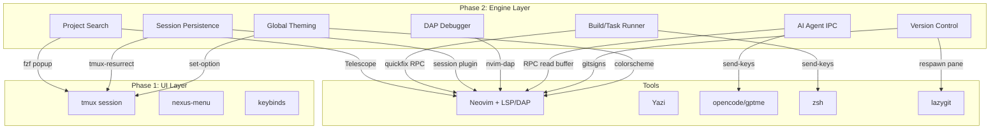

# Design: Nexus-Shell Phase 2 — Engine Layer

## 1. System Architecture

### 1.1 High-Level Overview
Phase 2 adds engine subsystems that connect the tools from Phase 1 into an integrated workflow. The key architectural insight: **Neovim is the engine hub** — it already speaks LSP, DAP, and has RPC. Nexus orchestrates around it using tmux IPC and nvim's `--server` pipe.



### 1.2 IPC Model
No custom daemons. All communication uses three existing channels:

| Channel | Direction | Use Case |
|---------|-----------|----------|
| `tmux send-keys -t <pane>` | Nexus → Tool | Send commands to terminal, trigger AI |
| `nvim --server <pipe> --remote-*` | Nexus → Nvim | Open files, populate quickfix, read buffers |
| File-based state (`/tmp/nexus_*`) | Any → Any | Share state between scripts |

## 2. Component Design

### 2.1 Project-Wide Search (Req-1)
**Strategy**: Two tiers — a tmux-level popup for quick file search from any pane, and Telescope inside Neovim for deep code search.

#### 2.1.1 Quick File Search (tmux popup)
**Location**: `core/search/quick_find.sh`
**Mechanism**: `tmux display-popup` launching `fzf` backed by `fd` or `find`. Selected file opens in the editor pane via nvim RPC.

```bash
# Triggered by a keybind (e.g., Alt-f)
FILE=$(fd --type f | fzf --preview 'bat --color=always {}')
nvim --server "$NVIM_PIPE" --remote "$FILE"
tmux select-pane -t editor
```

#### 2.1.2 Deep Code Search (Telescope)
**Location**: Neovim config (user-managed)
**Mechanism**: Telescope.nvim with `ripgrep` backend. Nexus provides a reference nvim config in `config/nvim/` but does not enforce it.

### 2.2 Build & Task Runner (Req-2)
**Location**: `core/exec/task_runner.sh` (new)
**Configuration**: Tasks defined in `.nexus.yaml`:

```yaml
# .nexus.yaml
tasks:
  build:
    command: "cargo build"
    output: terminal
  test:
    command: "cargo test"
    output: terminal
    on_error: quickfix
  lint:
    command: "ruff check ."
    output: popup
```

**Integration points**:
- **Menu**: `menu_engine.py` auto-discovers tasks from `.nexus.yaml` and shows them in a "Tasks" context
- **Command prompt**: `:build`, `:test`, `:lint` registered dynamically in dispatch
- **Quickfix**: On task failure, parse error output and send to nvim quickfix via RPC:
  ```bash
  nvim --server "$NVIM_PIPE" --remote-expr "v:lua.load_quickfix('$ERROR_FILE')"
  ```

### 2.3 Session Persistence (Req-3)
**Strategy**: Leverage existing tmux and nvim plugins. Nexus provides the glue.

#### 2.3.1 Tmux State
**Tool**: `tmux-resurrect` (installed as a tmux plugin)
**Configuration**: Nexus adds to `nexus.conf`:
```
set -g @resurrect-save 'S'
set -g @resurrect-restore 'R'
set -g @resurrect-strategy-nvim 'session'
```

#### 2.3.2 Nvim State
**Tool**: `persistence.nvim` or `mini.sessions` (in nvim config)
**Mechanism**: Auto-save session on `VimLeavePre`, auto-load on startup if inside a Nexus session (`$NEXUS_STATION_ACTIVE` is set).

#### 2.3.3 Nexus Wrapper
**Location**: `core/session/persist.sh` (new)
**Responsibilities**:
- On `:save` — trigger both tmux-resurrect save and nvim session save
- On `nxs` launch — detect saved state and offer to restore

### 2.4 Debugging — DAP (Req-4)
**Strategy**: DAP lives entirely inside Neovim. Nexus provides:
1. A reference nvim config with `nvim-dap` pre-configured
2. Project-level debug configs in `.nexus.yaml`
3. A keybind/menu item to start debugging

**Debug config in `.nexus.yaml`:**
```yaml
debug:
  python:
    adapter: debugpy
    config:
      type: python
      request: launch
      program: "${file}"
  rust:
    adapter: codelldb
    config:
      type: lldb
      request: launch
      program: "target/debug/${workspaceName}"
```

**Integration**: Nexus reads `.nexus.yaml` debug configs and writes them to a `.vscode/launch.json` format that `nvim-dap` can consume, or directly sends the config via nvim RPC.

### 2.5 AI Agent Integration (Req-5)
**Strategy**: Thin bridge scripts that pipe data between panes. No custom daemon.

**Location**: `core/ai/` (new directory)

#### 2.5.1 Context Passing
```bash
# core/ai/send_context.sh
# Reads current nvim buffer and sends it to the AI pane
BUFFER=$(nvim --server "$NVIM_PIPE" --remote-expr "getline(1, '$')" | head -200)
tmux send-keys -t chat "$BUFFER" Enter
```

#### 2.5.2 Error Piping
```bash
# core/ai/pipe_error.sh
# Sends last terminal output to the AI pane
tmux capture-pane -t terminal -p | tail -30 > /tmp/nexus_error_context.txt
tmux send-keys -t chat "analyze this error: $(cat /tmp/nexus_error_context.txt)" Enter
```

#### 2.5.3 Menu Integration
The "AI" menu context offers:
- Send current file to AI
- Send last error to AI
- Ask AI a question (opens popup prompt)

### 2.6 Version Control (Req-6)
**Strategy**: Lazygit for full git UI, gitsigns.nvim for in-editor indicators.

**Menu integration**: "Git" item in tools menu launches lazygit in-pane (same pattern as other tools).
**Keybind**: `Alt-g` already toggles tree/git. Extend to also work as a lazygit launcher.
**Nvim plugin**: `gitsigns.nvim` provides gutter indicators, inline blame, and hunk staging.

### 2.7 Global Theming (Req-7)
**Location**: `config/themes/` (new directory)

**Theme file format:**
```yaml
# config/themes/cyber.yaml
name: cyber
tmux:
  status_bg: "#0a0e14"
  status_fg: "cyan"
  border: "#1a1f2c"
  active_border: "cyan"
nvim:
  colorscheme: "tokyonight-night"
yazi:
  theme: "dark"
terminal:
  dim_inactive: true
  dim_amount: "fg=#666666"
```

**Mechanism**: `core/boot/theme.sh` reads the YAML file, applies tmux options via `set-option`, sends nvim colorscheme via RPC, and writes yazi theme config.

## 3. File Structure (Phase 2 additions)
```
nexus-shell/
├── core/
│   ├── ai/                          # NEW
│   │   ├── send_context.sh
│   │   └── pipe_error.sh
│   ├── exec/
│   │   ├── router.sh
│   │   └── task_runner.sh           # NEW
│   ├── search/                      # NEW
│   │   └── quick_find.sh
│   └── session/                     # NEW
│       └── persist.sh
├── config/
│   ├── nvim/                        # NEW (reference config)
│   │   └── init.lua
│   └── themes/                      # NEW
│       ├── cyber.yaml
│       ├── dark.yaml
│       └── light.yaml
└── docs/
    └── phase2/
        ├── requirements.md
        ├── design.md
        └── tasks.md
```
