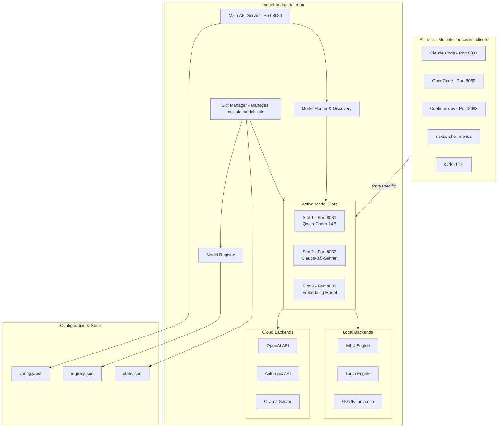

# Model-Bridge: Standalone Multi-Model Serving Daemon

## Overview

**model-bridge** is a standalone daemon service that provides unified OpenAI-compatible APIs for **multiple concurrent models**. It can host several models simultaneously on different ports, making it ideal for scenarios where different tools need different models at the same time.

**Key Characteristics:**
- **Standalone Service**: Runs as an independent daemon, not a nexus-shell module
- **Multi-Model Hosting**: Host multiple models concurrently on different ports
- **OpenAI-Compatible API**: Each hosted model gets its own OpenAI-compatible endpoint
- **Multi-Backend**: Supports MLX, Torch, GGUF locally; OpenAI, Anthropic, Ollama as cloud
- **Advanced Features**: Speculative decoding, KV-cache quantization, model hot-swapping
- **nexus-shell Friendly**: Can be controlled from menus but works independently

---

## Architecture



---

## Multi-Model Hosting Concept

### Slot-Based Architecture

Each hosted model runs in its own **slot** with a dedicated port:

```
┌─────────────────────────────────────────────────────────────┐
│                    model-bridge daemon                       │
│                                                              │
│  ┌─────────────────────────────────────────────────────┐    │
│  │ Main Server (Port 8080)                              │    │
│  │ - /v1/models         → List all hosted models        │    │
│  │ - /v1/slots          → List active slots             │    │
│  │ - /v1/host           → Host new model (creates slot) │    │
│  │ - /v1/slots/{id}/*   → Proxy to specific slot        │    │
│  └─────────────────────────────────────────────────────┘    │
│                                                              │
│  ┌──────────────┐ ┌──────────────┐ ┌──────────────┐         │
│  │ Slot 1       │ │ Slot 2       │ │ Slot 3       │         │
│  │ Port: 8081   │ │ Port: 8082   │ │ Port: 8083   │         │
│  │ Model: Qwen  │ │ Model: Claude│ │ Model: Embed │         │
│  │ Backend: MLX │ │ Backend: API │ │ Backend: MLX │         │
│  └──────────────┘ └──────────────┘ └──────────────┘         │
│                                                              │
└─────────────────────────────────────────────────────────────┘
```

### Access Patterns

**Option 1: Direct Slot Access (Recommended for tools)**
```bash
# Claude Code connects to slot 1
export ANTHROPIC_BASE_URL="http://localhost:8081/v1"

# OpenCode connects to slot 2
export OPENAI_BASE_URL="http://localhost:8082/v1"

# Embedding requests to slot 3
curl http://localhost:8083/v1/embeddings
```

**Option 2: Main Server with Model Selection**
```bash
# Route via model parameter
curl http://localhost:8080/v1/chat/completions \
  -d '{"model": "qwen-coder-14b", "messages": [...]}'
```

**Option 3: Slot Discovery**
```bash
# List all active slots
curl http://localhost:8080/v1/slots

# Response:
{
  "slots": [
    {"id": "slot-1", "port": 8081, "model": "Qwen-Coder-14B", "backend": "mlx"},
    {"id": "slot-2", "port": 8082, "model": "claude-3.5-sonnet", "backend": "anthropic"},
    {"id": "slot-3", "port": 8083, "model": "text-embedding-3-small", "backend": "openai"}
  ]
}
```

---

## Directory Structure

```
/Users/Shared/Projects/model-bridge/
├── bin/
│   ├── model-bridge              # Main daemon entry point
│   ├── mbr                       # Short alias for CLI
│   └── model-bridge-daemon       # Daemon launcher
├── lib/
│   ├── __init__.py
│   ├── server.py                 # FastAPI OpenAI-compatible server
│   ├── provider.py               # ModelProvider ABC
│   ├── router.py                 # Request routing logic
│   ├── model_manager.py          # Model lifecycle management
│   ├── registry.py               # Model registry handler
│   ├── backends/
│   │   ├── __init__.py
│   │   ├── mlx_backend.py        # MLX inference backend
│   │   ├── torch_backend.py      # PyTorch inference backend
│   │   ├── gguf_backend.py       # llama.cpp backend
│   │   ├── openai_backend.py     # OpenAI cloud backend
│   │   ├── anthropic_backend.py  # Anthropic cloud backend
│   │   └── ollama_backend.py     # Ollama server backend
│   └── advanced/
│       ├── __init__.py
│       ├── speculative.py        # Speculative decoding
│       ├── kv_cache.py           # KV-cache quantization
│       └── memory_mgr.py         # Memory management
├── config/
│   ├── config.yaml               # Main configuration
│   ├── providers.yaml            # Provider credentials
│   └── presets.yaml              # Hosting presets
├── data/
│   ├── registry.json             # Model registry
│   └── state.json                # Runtime state
├── scripts/
│   ├── install.sh                # Installation script
│   ├── start_daemon.sh           # Daemon start helper
│   └── health_check.sh           # Health check script
├── tests/
│   ├── test_server.py
│   ├── test_backends.py
│   └── test_integration.py
├── pyproject.toml                # Python project config
├── requirements.txt              # Dependencies
└── README.md                     # Documentation
```

---

## API Specification

### Main Server Endpoints (Port 8080)

```
# Slot Management
GET  /v1/slots                     # List all active slots
POST /v1/slots                     # Create new slot (host model)
GET  /v1/slots/{slot_id}           # Get slot details
DEL  /v1/slots/{slot_id}           # Remove slot (unhost model)

# Model Discovery
GET  /v1/models                    # List ALL models (hosted + registry)
GET  /v1/models/registry           # List models in registry
GET  /v1/backends                  # List available backends

# Registry Management
POST /v1/registry/scan             # Scan for new models
POST /v1/registry/add              # Add model path
DEL  /v1/registry/{model_id}       # Remove from registry

# Daemon Status
GET  /health                       # Health check
GET  /status                       # Detailed daemon status
GET  /metrics                      # Prometheus-style metrics
```

### Slot Endpoints (Per-Model Ports 8081+)

Each slot exposes a full OpenAI-compatible API on its assigned port:

```
# Slot on port 8081, 8082, 8083, etc.
POST /v1/chat/completions          # Chat completions (streaming supported)
POST /v1/completions               # Legacy completions
GET  /v1/models                    # Returns just this slot's model
POST /v1/embeddings                # Generate embeddings (if supported)
GET  /health                       # Slot health check
```

### Example: Hosting Multiple Models

```bash
# Create slot 1: Local coding assistant
curl -X POST http://localhost:8080/v1/slots \
  -d '{
    "model_id": "Qwen2.5-Coder-14B-Instruct-4bit",
    "backend": "mlx",
    "port": 8081,
    "preset": "speed",
    "draft_model": "Qwen2.5-0.5B-Instruct"
  }'

# Response:
{
  "slot_id": "slot-8081",
  "port": 8081,
  "model": "Qwen2.5-Coder-14B-Instruct-4bit",
  "backend": "mlx",
  "status": "ready",
  "endpoints": {
    "chat": "http://localhost:8081/v1/chat/completions",
    "models": "http://localhost:8081/v1/models"
  }
}

# Create slot 2: Cloud reasoning model
curl -X POST http://localhost:8080/v1/slots \
  -d '{
    "model_id": "claude-3-5-sonnet-latest",
    "backend": "anthropic",
    "port": 8082
  }'

# Create slot 3: Embedding service
curl -X POST http://localhost:8080/v1/slots \
  -d '{
    "model_id": "text-embedding-3-small",
    "backend": "openai",
    "port": 8083
  }'

# List all active slots
curl http://localhost:8080/v1/slots

# Response:
{
  "slots": [
    {
      "slot_id": "slot-8081",
      "port": 8081,
      "model": "Qwen2.5-Coder-14B-Instruct-4bit",
      "backend": "mlx",
      "status": "ready",
      "memory_mb": 8192,
      "requests_total": 42
    },
    {
      "slot_id": "slot-8082",
      "port": 8082,
      "model": "claude-3-5-sonnet-latest",
      "backend": "anthropic",
      "status": "ready"
    },
    {
      "slot_id": "slot-8083",
      "port": 8083,
      "model": "text-embedding-3-small",
      "backend": "openai",
      "status": "ready"
    }
  ],
  "total_slots": 3,
  "memory_used_mb": 8192,
  "memory_available_mb": 40960
}
```

---

## CLI Interface

### model-bridge (or mbr) Commands

```bash
# Daemon Management
model-bridge start [--port 8080] [--config path]
model-bridge stop [--force]
model-bridge restart
model-bridge status [--json]

# Slot Management (Multi-Model Hosting)
model-bridge host <model_id> [options]
  --backend <mlx|torch|gguf|openai|anthropic>
  --port <port>                   # Specific port (auto-assigned if omitted)
  --name <slot_name>              # Friendly name for slot
  --draft <model_id>              # Speculative decoding
  --kv-bits <4|6|8|16>            # KV-cache quantization
  --preset <speed|balanced|quality|power>
  --memory <limit>

model-bridge unhost <slot_id|port> [--force]
model-bridge unhost --all

# Slot Information
model-bridge slots [--json]
model-bridge slots list
model-bridge slots show <slot_id>

# Model Registry
model-bridge list [--backend mlx|torch|gguf] [--format table|json|menu]
model-bridge registry scan
model-bridge registry add <path>
model-bridge registry remove <id>

# Quick Actions
model-bridge switch <slot_id> <model_id>   # Hot-swap model in slot
model-bridge preset <slot_id> <name>       # Apply preset to slot

# Connection Helpers
model-bridge connect <slot_id>             # Print connection info for tools
model-bridge env <slot_id>                 # Export environment variables
```

### Example CLI Usage

```bash
# Start the daemon
model-bridge start

# Host a local coding model with speculative decoding
model-bridge host Qwen2.5-Coder-14B-Instruct-4bit \
  --backend mlx \
  --port 8081 \
  --name coder \
  --draft Qwen2.5-0.5B-Instruct \
  --preset speed

# Host a cloud model for reasoning
model-bridge host claude-3-5-sonnet-latest \
  --backend anthropic \
  --port 8082 \
  --name reasoner

# Host an embedding model
model-bridge host text-embedding-3-small \
  --backend openai \
  --port 8083 \
  --name embedder

# List all active slots
model-bridge slots

# Output:
# SLOT      PORT    MODEL                           BACKEND    STATUS
# coder     8081    Qwen2.5-Coder-14B-Instruct-4bit mlx        ready
# reasoner  8082    claude-3-5-sonnet-latest        anthropic  ready
# embedder  8083    text-embedding-3-small          openai     ready

# Get connection info for Claude Code
model-bridge connect coder

# Output:
# Slot: coder (port 8081)
# Model: Qwen2.5-Coder-14B-Instruct-4bit
#
# For Claude Code:
#   export ANTHROPIC_BASE_URL="http://localhost:8081/v1"
#
# For OpenCode:
#   export OPENAI_BASE_URL="http://localhost:8081/v1"

# Export environment variables
model-bridge env coder

# Output (ready to eval):
# export MODEL_BRIDGE_SLOT="coder"
# export MODEL_BRIDGE_PORT="8081"
# export ANTHROPIC_BASE_URL="http://localhost:8081/v1"
# export OPENAI_BASE_URL="http://localhost:8081/v1"
```

---

## Configuration

### config/config.yaml

```yaml
# Server Configuration
server:
  host: "0.0.0.0"
  port: 8080
  api_prefix: "/v1"
  cors_origins:
    - "http://localhost:*"
    - "http://127.0.0.1:*"

# Daemon Configuration
daemon:
  pid_file: "/tmp/model-bridge.pid"
  log_file: "/tmp/model-bridge.log"
  state_file: "/Users/Shared/Projects/model-bridge/data/state.json"

# Model Registry
registry:
  path: "/Users/Shared/Projects/model-bridge/data/registry.json"
  scan_paths:
    - "/Users/Shared/AI_CORE/models"
    - "/Volumes/Model-Archive"
  auto_scan: true
  scan_interval: 300  # seconds

# Backends Configuration
backends:
  mlx:
    enabled: true
    gpu_memory_fraction: 0.9
    default_context_length: 8192
  
  torch:
    enabled: true
    device: "mps"
  
  gguf:
    enabled: true
    llama_cpp_path: "/usr/local/bin/llama-server"
  
  openai:
    enabled: true
    api_key_env: "OPENAI_API_KEY"
  
  anthropic:
    enabled: true
    api_key_env: "ANTHROPIC_API_KEY"
  
  ollama:
    enabled: false
    base_url: "http://localhost:11434"

# Default Hosting
defaults:
  backend: "mlx"
  max_tokens: 4096
  temperature: 0.7
  stream: true
```

### config/presets.yaml

```yaml
presets:
  speed:
    description: "Maximum inference speed"
    draft: "auto"
    kv_bits: 4
    max_tokens: 2048
    temperature: 0.7
  
  balanced:
    description: "Balance between speed and quality"
    draft: "auto"
    kv_bits: 6
    max_tokens: 4096
    temperature: 0.7
  
  quality:
    description: "Best output quality"
    draft: null
    kv_bits: 16
    max_tokens: 8192
    temperature: 0.5
  
  power:
    description: "Minimal power consumption"
    draft: null
    kv_bits: 4
    max_tokens: 1024
    memory_limit: "8G"
    temperature: 0.7
```

---

## Core Components

### 1. Slot Manager (lib/slot_manager.py)

The Slot Manager is the heart of the multi-model architecture. It manages multiple model slots, each with its own port and backend.

```python
import asyncio
from typing import Dict, Optional, List, Any
from dataclasses import dataclass, field
from datetime import datetime
import socket
import json
from pathlib import Path

from .provider import ModelProvider, BackendType, HostingConfig, HostingStatus, ModelInfo
from .backends import get_backend
from .registry import ModelRegistry

@dataclass
class ModelSlot:
    """Represents a hosted model slot."""
    slot_id: str
    name: str
    port: int
    model_id: str
    backend_type: BackendType
    config: HostingConfig
    backend: ModelProvider
    created_at: datetime = field(default_factory=datetime.now)
    requests_count: int = 0
    status: str = "initializing"  # initializing, ready, error, stopping
    
    def to_dict(self) -> dict:
        return {
            "slot_id": self.slot_id,
            "name": self.name,
            "port": self.port,
            "model_id": self.model_id,
            "backend": self.backend_type.value,
            "status": self.status,
            "created_at": self.created_at.isoformat(),
            "requests_count": self.requests_count,
            "memory_mb": self.backend.get_memory_usage() if hasattr(self.backend, 'get_memory_usage') else None,
        }


class SlotManager:
    """Manages multiple model slots with dedicated ports."""
    
    _instance: Optional["SlotManager"] = None
    
    def __init__(self, config: dict = None):
        self.config = config or {}
        self.slots: Dict[str, ModelSlot] = {}  # slot_id -> ModelSlot
        self.port_index: Dict[int, str] = {}    # port -> slot_id
        self.registry = ModelRegistry()
        self._lock = asyncio.Lock()
        
        SlotManager._instance = self
    
    @classmethod
    def get_instance(cls) -> "SlotManager":
        if cls._instance is None:
            cls._instance = cls()
        return cls._instance
    
    def _find_available_port(self, start_port: int = 8081) -> int:
        """Find the next available port."""
        port = start_port
        while port in self.port_index:
            port += 1
        return port
    
    def _generate_slot_id(self, port: int) -> str:
        """Generate a unique slot ID."""
        return f"slot-{port}"
    
    async def create_slot(self, config: dict) -> ModelSlot:
        """Create a new model slot."""
        async with self._lock:
            # Determine port
            port = config.get("port")
            if port and port in self.port_index:
                raise ValueError(f"Port {port} already in use")
            if not port:
                port = self._find_available_port()
            
            # Get model info from registry
            model_id = config["model_id"]
            model_info = self.registry.get_model(model_id)
            if not model_info:
                raise ValueError(f"Model {model_id} not found in registry")
            
            # Determine backend
            backend_type = BackendType(config.get("backend", model_info.backend.value))
            
            # Create hosting config
            hosting_config = HostingConfig(
                model_id=model_id,
                backend=backend_type,
                port=port,
                draft_model=config.get("draft_model"),
                kv_bits=config.get("kv_bits"),
                max_tokens=config.get("max_tokens", 4096),
                temperature=config.get("temperature", 0.7),
                memory_limit=config.get("memory_limit"),
            )
            
            # Create backend instance
            backend = get_backend(backend_type)
            
            # Create slot
            slot = ModelSlot(
                slot_id=self._generate_slot_id(port),
                name=config.get("name", model_id),
                port=port,
                model_id=model_id,
                backend_type=backend_type,
                config=hosting_config,
                backend=backend,
            )
            
            # Register slot
            self.slots[slot.slot_id] = slot
            self.port_index[port] = slot.slot_id
            
            try:
                # Load model in backend
                success = await backend.load(hosting_config)
                if success:
                    slot.status = "ready"
                    self._save_state()
                else:
                    slot.status = "error"
                    raise RuntimeError(f"Failed to load model {model_id}")
            except Exception as e:
                # Cleanup on failure
                del self.slots[slot.slot_id]
                del self.port_index[port]
                raise e
            
            return slot
    
    async def remove_slot(self, slot_id: str, force: bool = False) -> None:
        """Remove a model slot."""
        async with self._lock:
            if slot_id not in self.slots:
                raise ValueError(f"Slot {slot_id} not found")
            
            slot = self.slots[slot_id]
            slot.status = "stopping"
            
            try:
                await slot.backend.unload()
            except Exception as e:
                if not force:
                    raise e
            
            del self.slots[slot_id]
            del self.port_index[slot.port]
            self._save_state()
    
    async def remove_all_slots(self, force: bool = False) -> None:
        """Remove all slots."""
        for slot_id in list(self.slots.keys()):
            try:
                await self.remove_slot(slot_id, force=force)
            except Exception:
                if not force:
                    raise
    
    def get_slot(self, slot_id: str) -> Optional[ModelSlot]:
        """Get slot by ID."""
        return self.slots.get(slot_id)
    
    def get_slot_by_port(self, port: int) -> Optional[ModelSlot]:
        """Get slot by port number."""
        slot_id = self.port_index.get(port)
        if slot_id:
            return self.slots.get(slot_id)
        return None
    
    def list_slots(self) -> List[ModelSlot]:
        """List all active slots."""
        return list(self.slots.values())
    
    def get_status(self) -> dict:
        """Get overall status."""
        total_memory = sum(
            s.backend.get_memory_usage()
            for s in self.slots.values()
            if hasattr(s.backend, 'get_memory_usage')
        )
        return {
            "total_slots": len(self.slots),
            "slots": [s.to_dict() for s in self.slots.values()],
            "memory_used_mb": total_memory,
        }
    
    def _save_state(self) -> None:
        """Persist state to disk."""
        state_path = Path(self.config.get("state_file", "data/state.json"))
        state_path.parent.mkdir(parents=True, exist_ok=True)
        
        state = {
            "slots": [s.to_dict() for s in self.slots.values()],
            "updated_at": datetime.now().isoformat(),
        }
        state_path.write_text(json.dumps(state, indent=2))
```

### 2. Main Server (lib/server.py)

The main server runs on port 8080 and handles slot management plus request routing.

```python
from fastapi import FastAPI, HTTPException
from fastapi.responses import StreamingResponse, JSONResponse
from pydantic import BaseModel
from typing import List, Optional
import uvicorn

from .slot_manager import SlotManager, ModelSlot
from .slot_server import SlotServer

app = FastAPI(title="Model-Bridge", version="1.0.0")

# --- Request/Response Schemas ---

class CreateSlotRequest(BaseModel):
    model_id: str
    backend: Optional[str] = None
    port: Optional[int] = None
    name: Optional[str] = None
    draft_model: Optional[str] = None
    kv_bits: Optional[int] = None
    preset: Optional[str] = None
    memory_limit: Optional[str] = None

class ChatMessage(BaseModel):
    role: str
    content: str | list = ""

class ChatCompletionRequest(BaseModel):
    model: str
    messages: List[ChatMessage]
    temperature: Optional[float] = 0.7
    max_tokens: Optional[int] = 4096
    stream: Optional[bool] = False

# --- Slot Management Endpoints ---

@app.get("/v1/slots")
async def list_slots():
    """List all active model slots."""
    manager = SlotManager.get_instance()
    return manager.get_status()

@app.post("/v1/slots")
async def create_slot(request: CreateSlotRequest):
    """Create a new model slot."""
    manager = SlotManager.get_instance()
    
    config = request.model_dump()
    
    # Apply preset if specified
    if request.preset:
        config.update(load_preset(request.preset))
    
    slot = await manager.create_slot(config)
    
    # Start the slot's API server
    slot_server = SlotServer(slot)
    await slot_server.start()
    
    return {
        "slot_id": slot.slot_id,
        "port": slot.port,
        "model": slot.model_id,
        "backend": slot.backend_type.value,
        "status": slot.status,
        "endpoints": {
            "chat": f"http://localhost:{slot.port}/v1/chat/completions",
            "models": f"http://localhost:{slot.port}/v1/models",
        }
    }

@app.get("/v1/slots/{slot_id}")
async def get_slot(slot_id: str):
    """Get details for a specific slot."""
    manager = SlotManager.get_instance()
    slot = manager.get_slot(slot_id)
    if not slot:
        raise HTTPException(404, f"Slot {slot_id} not found")
    return slot.to_dict()

@app.delete("/v1/slots/{slot_id}")
async def delete_slot(slot_id: str, force: bool = False):
    """Remove a model slot."""
    manager = SlotManager.get_instance()
    await manager.remove_slot(slot_id, force=force)
    return {"status": "removed"}

# --- Model Discovery Endpoints ---

@app.get("/v1/models")
async def list_all_models():
    """List all models (hosted + registry)."""
    from .registry import ModelRegistry
    manager = SlotManager.get_instance()
    registry = ModelRegistry()
    
    models = []
    
    # Add hosted models
    for slot in manager.list_slots():
        models.append({
            "id": slot.model_id,
            "object": "model",
            "owned_by": "model-bridge",
            "hosted": True,
            "slot_id": slot.slot_id,
            "port": slot.port,
        })
    
    # Add registry models
    for model in registry.list_all_models():
        if not any(m["id"] == model["id"] for m in models):
            models.append({
                "id": model["id"],
                "object": "model",
                "owned_by": model.get("backend", "unknown"),
                "hosted": False,
            })
    
    return {"data": models}

@app.get("/v1/backends")
async def list_backends():
    """List available backends."""
    return {
        "backends": [
            {"id": "mlx", "name": "MLX", "type": "local", "enabled": True},
            {"id": "torch", "name": "PyTorch", "type": "local", "enabled": True},
            {"id": "gguf", "name": "GGUF/llama.cpp", "type": "local", "enabled": True},
            {"id": "openai", "name": "OpenAI", "type": "cloud", "enabled": True},
            {"id": "anthropic", "name": "Anthropic", "type": "cloud", "enabled": True},
            {"id": "ollama", "name": "Ollama", "type": "proxy", "enabled": False},
        ]
    }

# --- Daemon Status ---

@app.get("/health")
async def health():
    return {"status": "healthy"}

@app.get("/status")
async def status():
    manager = SlotManager.get_instance()
    return manager.get_status()
```

### 3. Slot Server (lib/slot_server.py)

Each slot gets its own FastAPI server on its assigned port, providing a full OpenAI-compatible API.

```python
import asyncio
from fastapi import FastAPI, HTTPException
from fastapi.responses import StreamingResponse
from pydantic import BaseModel
from typing import List, Optional, AsyncIterator
import uvicorn

from .slot_manager import ModelSlot

class SlotServer:
    """OpenAI-compatible API server for a single model slot."""
    
    def __init__(self, slot: ModelSlot):
        self.slot = slot
        self.app = FastAPI(title=f"Model-Bridge Slot {slot.name}")
        self.server_task = None
        self._setup_routes()
    
    def _setup_routes(self):
        """Setup OpenAI-compatible routes for this slot."""
        
        @self.app.get("/v1/models")
        async def models():
            return {
                "data": [{
                    "id": self.slot.model_id,
                    "object": "model",
                    "owned_by": "model-bridge",
                }]
            }
        
        @self.app.post("/v1/chat/completions")
        async def chat_completions(request: dict):
            if self.slot.status != "ready":
                raise HTTPException(503, f"Slot status: {self.slot.status}")
            
            self.slot.requests_count += 1
            
            if request.get("stream"):
                return StreamingResponse(
                    self._stream_chat(request),
                    media_type="text/event-stream"
                )
            else:
                return await self._chat(request)
        
        @self.app.post("/v1/completions")
        async def completions(request: dict):
            if self.slot.status != "ready":
                raise HTTPException(503, f"Slot status: {self.slot.status}")
            
            self.slot.requests_count += 1
            
            if request.get("stream"):
                return StreamingResponse(
                    self._stream_complete(request),
                    media_type="text/event-stream"
                )
            else:
                return await self._complete(request)
        
        @self.app.post("/v1/embeddings")
        async def embeddings(request: dict):
            if self.slot.status != "ready":
                raise HTTPException(503, f"Slot status: {self.slot.status}")
            
            self.slot.requests_count += 1
            return await self._embed(request)
        
        @self.app.get("/health")
        async def health():
            return {
                "status": "healthy" if self.slot.status == "ready" else "unhealthy",
                "slot": self.slot.slot_id,
                "model": self.slot.model_id,
            }
    
    async def _chat(self, request: dict) -> dict:
        """Non-streaming chat completion."""
        response = await self.slot.backend.chat(
            messages=request.get("messages", []),
            stream=False,
            **{k: v for k, v in request.items() if k not in ["messages", "stream"]}
        )
        return response
    
    async def _stream_chat(self, request: dict) -> AsyncIterator[str]:
        """Streaming chat completion."""
        async for chunk in self.slot.backend.chat(
            messages=request.get("messages", []),
            stream=True,
            **{k: v for k, v in request.items() if k not in ["messages", "stream"]}
        ):
            yield f"data: {chunk}\n\n"
        yield "data: [DONE]\n\n"
    
    async def _complete(self, request: dict) -> dict:
        """Non-streaming completion."""
        response = await self.slot.backend.complete(
            prompt=request.get("prompt", ""),
            stream=False,
            **{k: v for k, v in request.items() if k not in ["prompt", "stream"]}
        )
        return response
    
    async def _stream_complete(self, request: dict) -> AsyncIterator[str]:
        """Streaming completion."""
        async for chunk in self.slot.backend.complete(
            prompt=request.get("prompt", ""),
            stream=True,
            **{k: v for k, v in request.items() if k not in ["prompt", "stream"]}
        ):
            yield f"data: {chunk}\n\n"
        yield "data: [DONE]\n\n"
    
    async def _embed(self, request: dict) -> dict:
        """Generate embeddings."""
        response = await self.slot.backend.embed(
            input=request.get("input", []),
            **{k: v for k, v in request.items() if k != "input"}
        )
        return response
    
    async def start(self):
        """Start the slot server in background."""
        config = uvicorn.Config(
            self.app,
            host="0.0.0.0",
            port=self.slot.port,
            log_level="warning",
        )
        server = uvicorn.Server(config)
        self.server_task = asyncio.create_task(server.serve())
    
    async def stop(self):
        """Stop the slot server."""
        if self.server_task:
            self.server_task.cancel()
            try:
                await self.server_task
            except asyncio.CancelledError:
                pass
```

### 2. Model Provider Interface (lib/provider.py)

```python
from abc import ABC, abstractmethod
from typing import Dict, Any, Optional, List, AsyncIterator
from dataclasses import dataclass
from enum import Enum

class BackendType(Enum):
    MLX = "mlx"
    TORCH = "torch"
    GGUF = "gguf"
    OPENAI = "openai"
    ANTHROPIC = "anthropic"
    OLLAMA = "ollama"

@dataclass
class ModelInfo:
    id: str
    name: str
    backend: BackendType
    capabilities: List[str]  # chat, completion, embedding, vision
    context_length: int
    quantization: Optional[str] = None
    path: Optional[str] = None
    params_billions: Optional[float] = None

@dataclass
class HostingConfig:
    model_id: str
    backend: BackendType
    port: int = 8080
    draft_model: Optional[str] = None
    kv_bits: Optional[int] = None
    max_tokens: int = 4096
    temperature: float = 0.7
    memory_limit: Optional[str] = None

@dataclass
class HostingStatus:
    active: bool
    model_id: Optional[str]
    backend: Optional[BackendType]
    port: Optional[int]
    pid: Optional[int]
    memory_mb: Optional[int]
    uptime_seconds: Optional[int]
    config: Optional[Dict[str, Any]] = None

class ModelProvider(ABC):
    """Abstract base class for all inference backends."""
    
    @abstractmethod
    async def list_models(self) -> List[ModelInfo]:
        """List available models from this backend."""
        pass
    
    @abstractmethod
    async def load(self, config: HostingConfig) -> bool:
        """Load a model into memory."""
        pass
    
    @abstractmethod
    async def unload(self) -> None:
        """Unload the model from memory."""
        pass
    
    @abstractmethod
    async def chat(
        self, 
        messages: List[Dict], 
        stream: bool = False,
        **kwargs
    ) -> AsyncIterator[str]:
        """Generate chat completion."""
        pass
    
    @abstractmethod
    async def complete(
        self, 
        prompt: str, 
        stream: bool = False,
        **kwargs
    ) -> AsyncIterator[str]:
        """Generate text completion."""
        pass
    
    @abstractmethod
    def get_status(self) -> HostingStatus:
        """Get current hosting status."""
        pass
```

### 3. Model Manager (lib/model_manager.py)

```python
import asyncio
from typing import Optional, Dict, Any
from pathlib import Path
import json

from .provider import ModelProvider, BackendType, HostingConfig, HostingStatus
from .backends.mlx_backend import MLXBackend
from .backends.torch_backend import TorchBackend
from .backends.gguf_backend import GGUFBackend
from .backends.openai_backend import OpenAIBackend
from .backends.anthropic_backend import AnthropicBackend

class ModelManager:
    """Manages model lifecycle and routing."""
    
    _instance: Optional["ModelManager"] = None
    
    def __init__(self, config_path: str = None):
        self.config = self._load_config(config_path)
        self.active_backend: Optional[ModelProvider] = None
        self.hosting_config: Optional[HostingConfig] = None
        self.start_time: Optional[float] = None
        self._backends: Dict[BackendType, ModelProvider] = {}
        
        ModelManager._instance = self
    
    @classmethod
    def get_instance(cls) -> "ModelManager":
        if cls._instance is None:
            cls._instance = cls()
        return cls._instance
    
    def _load_config(self, path: str) -> dict:
        if path and Path(path).exists():
            return yaml.safe_load(Path(path).read_text())
        return {}
    
    def _get_backend(self, backend_type: BackendType) -> ModelProvider:
        if backend_type not in self._backends:
            if backend_type == BackendType.MLX:
                self._backends[backend_type] = MLXBackend()
            elif backend_type == BackendType.TORCH:
                self._backends[backend_type] = TorchBackend()
            elif backend_type == BackendType.GGUF:
                self._backends[backend_type] = GGUFBackend()
            elif backend_type == BackendType.OPENAI:
                self._backends[backend_type] = OpenAIBackend()
            elif backend_type == BackendType.ANTHROPIC:
                self._backends[backend_type] = AnthropicBackend()
        return self._backends[backend_type]
    
    async def host(self, config: dict) -> HostingStatus:
        """Host a model with the specified configuration."""
        backend_type = BackendType(config.get("backend", "mlx"))
        backend = self._get_backend(backend_type)
        
        hosting_config = HostingConfig(
            model_id=config["model_id"],
            backend=backend_type,
            port=config.get("port", 8080),
            draft_model=config.get("draft_model"),
            kv_bits=config.get("kv_bits"),
            max_tokens=config.get("max_tokens", 4096),
            temperature=config.get("temperature", 0.7),
        )
        
        # Unload any existing model
        if self.active_backend:
            await self.active_backend.unload()
        
        # Load the new model
        success = await backend.load(hosting_config)
        if success:
            self.active_backend = backend
            self.hosting_config = hosting_config
            self.start_time = asyncio.get_event_loop().time()
            self._save_state()
        
        return self.get_status()
    
    async def unhost(self) -> None:
        """Stop hosting the current model."""
        if self.active_backend:
            await self.active_backend.unload()
            self.active_backend = None
            self.hosting_config = None
            self.start_time = None
            self._save_state()
    
    def is_hosting(self) -> bool:
        return self.active_backend is not None
    
    def get_status(self) -> HostingStatus:
        if not self.active_backend:
            return HostingStatus(active=False, model_id=None, backend=None, port=None, pid=None, memory_mb=None, uptime_seconds=None)
        
        status = self.active_backend.get_status()
        if self.start_time:
            import time
            status.uptime_seconds = int(time.time() - self.start_time)
        status.config = self.hosting_config.__dict__ if self.hosting_config else None
        return status
    
    def _save_state(self) -> None:
        state_path = Path(self.config.get("daemon", {}).get("state_file", "data/state.json"))
        state_path.parent.mkdir(parents=True, exist_ok=True)
        
        status = self.get_status()
        state = {
            "active": status.active,
            "model_id": status.model_id,
            "backend": status.backend.value if status.backend else None,
            "port": status.port,
            "config": status.config
        }
        
        state_path.write_text(json.dumps(state, indent=2))
```

---

## nexus-shell Integration

Since model-bridge is a standalone service, nexus-shell integrates by calling its CLI or API.

### Updated menus/ai.yaml - Multi-Slot Aware

```yaml
title: "AI Cockpit & Model Slots"
context: "ai"
items:
  # Active Slots Overview
  - label: "📊 Active Slots"
    type: "ACTION"
    payload: "model-bridge slots"

  - separator: true

  # Quick Slot Creation
  - label: "── CREATE NEW SLOT ──"
    type: "SEPARATOR"
  
  - label: "🚀 MLX Model → New Slot"
    type: "ACTION"
    payload: "model-bridge list --backend mlx --format fzf | xargs -I {} model-bridge host {} --backend mlx"
  
  - label: "🔥 Torch Model → New Slot"
    type: "ACTION"
    payload: "model-bridge list --backend torch --format fzf | xargs -I {} model-bridge host {} --backend torch"
  
  - label: "🦙 GGUF Model → New Slot"
    type: "ACTION"
    payload: "model-bridge list --backend gguf --format fzf | xargs -I {} model-bridge host {} --backend gguf"

  - separator: true

  # Slot Presets - One click creates a configured slot
  - label: "── QUICK PRESETS ──"
    type: "SEPARATOR"

  - label: "⚡ Coder Slot - Speed Optimized"
    type: "ACTION"
    payload: |
      MODEL=$(model-bridge list --backend mlx --format fzf --grep coder)
      [ -n "$MODEL" ] && model-bridge host "$MODEL" --name coder --preset speed --port 8081

  - label: "🧠 Reasoner Slot - Quality First"
    type: "ACTION"
    payload: |
      MODEL=$(model-bridge list --backend mlx --format fzf --grep think)
      [ -n "$MODEL" ] && model-bridge host "$MODEL" --name reasoner --preset quality --port 8082

  - label: "☁️ Cloud Slot - Claude 3.5 Sonnet"
    type: "ACTION"
    payload: "model-bridge host claude-3-5-sonnet-latest --backend anthropic --name claude --port 8083"

  - label: "📊 Embedding Slot"
    type: "ACTION"
    payload: "model-bridge host text-embedding-3-small --backend openai --name embedder --port 8084"

  - separator: true

  # Advanced Slot Configuration
  - label: "── ADVANCED OPTIONS ──"
    type: "SEPARATOR"

  - label: "🚀 Speculative Decoding Slot"
    type: "ACTION"
    payload: |
      TARGET=$(model-bridge list --backend mlx --format fzf)
      DRAFT=$(model-bridge list --backend mlx --format fzf --small)
      [ -n "$TARGET" ] && [ -n "$DRAFT" ] && model-bridge host "$TARGET" --draft "$DRAFT" --name spec-decode

  - label: "💾 4-bit KV-Cache Slot"
    type: "ACTION"
    payload: |
      MODEL=$(model-bridge list --backend mlx --format fzf)
      [ -n "$MODEL" ] && model-bridge host "$MODEL" --kv-bits 4 --name kv4-slot

  - separator: true

  # Slot Management
  - label: "── SLOT MANAGEMENT ──"
    type: "SEPARATOR"

  - label: "📋 List All Slots"
    type: "ACTION"
    payload: "model-bridge slots"

  - label: "🔗 Connect to Slot..."
    type: "ACTION"
    payload: |
      SLOT=$(model-bridge slots --format fzf --field slot_id)
      [ -n "$SLOT" ] && model-bridge connect "$SLOT"

  - label: "⏹️ Stop Slot..."
    type: "ACTION"
    payload: |
      SLOT=$(model-bridge slots --format fzf --field slot_id)
      [ -n "$SLOT" ] && model-bridge unhost "$SLOT"

  - label: "🧹 Stop All Slots"
    type: "ACTION"
    payload: "model-bridge unhost --all"

  - separator: true

  # Registry
  - label: "🔄 Scan Registry"
    type: "ACTION"
    payload: "model-bridge registry scan"

  - label: "🛡️ Sovereignty Menu"
    type: "PLANE"
    payload: "sovereignty"
```

### Commands for core/api/registry.json

```json
{
  "names": ["slots", ":slots"],
  "action": "model-bridge slots",
  "description": "List all active model slots",
  "category": "AI"
},
{
  "names": ["host", ":host"],
  "action": "model-bridge list --format fzf | xargs -I {} model-bridge host {}",
  "description": "Create a new model slot",
  "category": "AI"
},
{
  "names": ["unhost", ":unhost"],
  "action": "model-bridge slots --format fzf --field slot_id | xargs -I {} model-bridge unhost {}",
  "description": "Stop a model slot",
  "category": "AI"
},
{
  "names": ["connect", ":connect"],
  "action": "model-bridge slots --format fzf --field slot_id | xargs -I {} model-bridge connect {}",
  "description": "Get connection info for a slot",
  "category": "AI"
},
{
  "names": ["coder", ":coder"],
  "action": "model-bridge host Qwen2.5-Coder-14B-Instruct-4bit --backend mlx --name coder --preset speed --port 8081",
  "description": "Quick: Start coder slot on port 8081",
  "category": "AI"
},
{
  "names": ["claude", ":claude"],
  "action": "model-bridge host claude-3-5-sonnet-latest --backend anthropic --name claude --port 8082",
  "description": "Quick: Start Claude slot on port 8082",
  "category": "AI"
}
```

### Environment Variable Helper

Add to shell profile or nexus-shell env:

```bash
# Model-Bridge Quick Connect Functions
mbr-use() {
    local slot=$1
    eval $(model-bridge env "$slot")
}

mbr-coder() {
    mbr-use coder
    echo "✅ Now using coder slot: $ANTHROPIC_BASE_URL"
}

mbr-claude() {
    mbr-use claude
    echo "✅ Now using claude slot: $ANTHROPIC_BASE_URL"
}
```

---

## Client Configuration Examples

### Claude Code

```bash
# Set environment variable
export ANTHROPIC_BASE_URL="http://localhost:8080/v1"

# Or in Claude Code settings
claude-code config set baseUrl http://localhost:8080/v1
```

### OpenCode

```yaml
# opencode.yaml
model:
  provider: "openai-compatible"
  base_url: "http://localhost:8080/v1"
  model: "hosted-model"
```

### Continue.dev

```json
{
  "models": [{
    "title": "Model-Bridge",
    "provider": "openai",
    "apiBase": "http://localhost:8080/v1",
    "model": "auto"
  }]
}
```

---

## Implementation Phases

### Phase 1: Core Daemon
- Create project structure
- Implement FastAPI server with OpenAI-compatible endpoints
- Implement ModelProvider interface
- Create basic CLI (start, stop, status)

### Phase 2: Local Backends
- Implement MLX backend
- Implement Torch backend
- Implement GGUF backend
- Registry scanning

### Phase 3: Advanced Features
- Speculative decoding support
- KV-cache quantization
- Presets system
- Hot-swapping

### Phase 4: Cloud Backends
- OpenAI cloud backend
- Anthropic cloud backend
- Ollama backend
- Request routing

### Phase 5: Integration & Polish
- nexus-shell menu integration
- Dashboard integration
- Documentation
- Testing

---

## Next Steps

1. **Review and approve this design**
2. **Create the project directory structure**
3. **Implement the FastAPI server**
4. **Implement the MLX backend**
5. **Add cloud backends**
6. **Integrate with nexus-shell menus**
